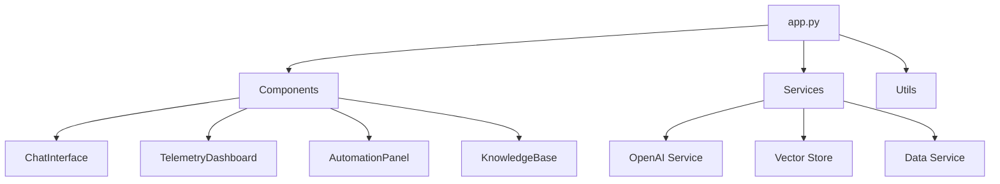

# Integrated Platform Environment (IPE) - System Architecture Documentation
________________________________________

## Table of Contents
1. System Overview
2. Core Components
3. Data Flow Architecture
4. Services Layer
5. Utilities
6. Configuration Management
7. Vector Database Integration
8. OpenAI Integration
9. Sample Data Management
10. Security and Authentication
11. Deployment Architecture

## 1. System Overview

### 1.1 Application Entry Point (app.py)
```python
# Main application flow in app.py
def main():
    # 1. Configuration Validation
    Config.validate()
    
    # 2. Session State Initialization
    initialize_session_state()
    
    # 3. Authentication Check
    if not check_authentication():
        return
        
    # 4. Main UI Components
    current_page = render_sidebar()
    
    # 5. Page Routing
    if current_page == "Dashboard":
        TelemetryDashboard().render()
    elif current_page == "Chat Support":
        ChatInterface().render()
    # ... other pages
```

The application follows a modular architecture with these key components:
- UI Components (Streamlit-based)
- Services Layer (Business Logic)
- Data Layer (Vector Store & Sample Data)
- Integration Layer (OpenAI, APIs)

### 1.2 Component Dependencies


## 2. Core Components

### 2.1 ChatInterface Component
```python:src/components/chat_interface.py
class ChatInterface:
    def __init__(self):
        self.data_service = DataService()
        self.openai_service = OpenAIService()
        self.vector_store = VectorStore()

    def render(self):
        # 1. Load context and history
        # 2. Process user input
        # 3. Search relevant information
        # 4. Generate AI response
        # 5. Update chat history
```

Key Features:
- Context-aware conversations
- Vector similarity search
- Knowledge base integration
- Chat history management

### 2.2 TelemetryDashboard Component
```python:src/components/telemetry_dashboard.py
class TelemetryDashboard:
    def __init__(self):
        self.telemetry_service = TelemetryService()
        self.alerts_service = AlertsService()

    def render(self):
        # 1. Load telemetry data
        # 2. Process metrics
        # 3. Generate visualizations
        # 4. Display alerts
```

Features:
- Real-time metrics visualization
- Alert management
- System health monitoring
- Interactive charts

### 2.3 AutomationPanel Component
```python:src/components/automation_panel.py
class AutomationPanel:
    def __init__(self):
        self.ansible_service = AnsibleService()
        self.health_check_service = HealthCheckService()

    def render(self):
        # 1. Display available playbooks
        # 2. Handle automation requests
        # 3. Show execution results
        # 4. Track automation history
```

Features:
- Ansible playbook integration
- Health check automation
- Execution tracking
- Result visualization

## 3. Data Flow Architecture

### 3.1 Vector Store Integration
```python:src/services/vector_store.py
class VectorStore:
    def __init__(self):
        self.client = chromadb.PersistentClient(
            path="./data/vectordb"
        )
        self.collections = self._initialize_collections()

    def _initialize_collections(self):
        return {
            "incidents": self._create_collection("incidents"),
            "kb_articles": self._create_collection("kb_articles"),
            "telemetry": self._create_collection("telemetry")
        }
```

ChromaDB Usage:
1. Document Processing:
   ```python
   def add_documents(self, collection_name: str, documents: List[Dict]):
       collection = self.collections[collection_name]
       
       # Generate embeddings using OpenAI
       embeddings = self.openai_service.get_embeddings(
           [doc["text"] for doc in documents]
       )
       
       # Add to ChromaDB
       collection.add(
           embeddings=embeddings,
           documents=[doc["text"] for doc in documents],
           metadatas=[doc["metadata"] for doc in documents]
       )
   ```

2. Similarity Search:
   ```python
   def search_similar(self, collection_name: str, query: str, n_results: int = 5):
       collection = self.collections[collection_name]
       
       # Generate query embedding
       query_embedding = self.openai_service.get_embeddings(query)
       
       # Search in ChromaDB
       results = collection.query(
           query_embeddings=[query_embedding],
           n_results=n_results
       )
       
       return results
   ```

### 3.2 Sample Data Integration
```python:src/services/data_service.py
class DataService:
    def __init__(self):
        self.dataset_loader = DatasetLoader()
        self.vector_store = VectorStore()
        self._initialize_data()

    def _initialize_data(self):
        # Load sample datasets
        incidents = self.dataset_loader.load_dataset("incidents")
        kb_articles = self.dataset_loader.load_dataset("kb_articles")
        
        # Add to vector store
        self.vector_store.add_documents("incidents", incidents)
        self.vector_store.add_documents("kb_articles", kb_articles)
```

Data Flow:
1. Load sample data
2. Generate embeddings
3. Store in ChromaDB
4. Enable similarity search
5. Update as needed

[Continued in Part 2...] 