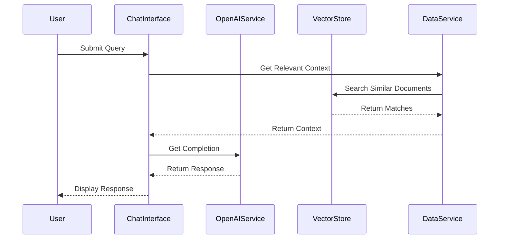
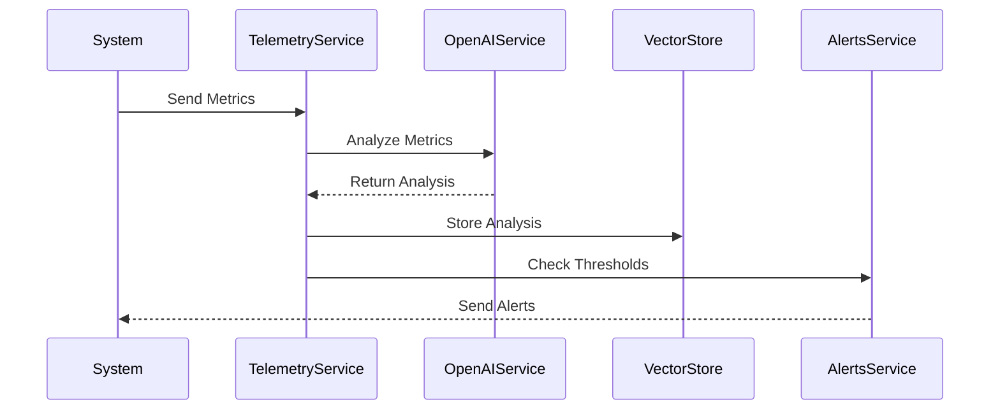

 # Integrated Platform Environment (IPE) - System Architecture Documentation (Part 2)
________________________________________

## 4. OpenAI Integration & Services Layer

### 4.1 OpenAI Service Implementation
```python:src/services/openai_service.py
from openai import OpenAI
from typing import List, Dict, Any
from config.config import Config

class OpenAIService:
    def __init__(self):
        self.client = OpenAI(api_key=Config.OPENAI_API_KEY)
        self.model = Config.OPENAI_MODEL
        self.embedding_model = "text-embedding-ada-002"
        
        # System prompts for different functionalities
        self.prompts = {
            "support": """You are an IT support assistant. Use the following context 
                        to provide accurate and relevant solutions...""",
            "analysis": """Analyze the given telemetry data and identify potential 
                         issues or anomalies...""",
            "rca": """Based on the incident details and telemetry data, provide 
                     a root cause analysis..."""
        }

    def get_completion(self, 
                      prompt: str, 
                      context: Dict[str, Any] = None, 
                      prompt_type: str = "support") -> str:
        """
        Get AI completion with context
        Args:
            prompt: User query
            context: Additional context (incidents, KB articles, etc.)
            prompt_type: Type of system prompt to use
        """
        # Prepare messages with context
        messages = [
            {"role": "system", "content": self.prompts[prompt_type]},
        ]
        
        # Add context if available
        if context:
            context_str = self._format_context(context)
            messages.append({"role": "system", "content": context_str})
        
        # Add user query
        messages.append({"role": "user", "content": prompt})
        
        try:
            response = self.client.chat.completions.create(
                model=self.model,
                messages=messages,
                temperature=0.7,
                max_tokens=1000
            )
            return response.choices[0].message.content
        except Exception as e:
            return f"Error getting AI response: {str(e)}"

    def get_embeddings(self, texts: List[str]) -> List[List[float]]:
        """Generate embeddings for vector search"""
        try:
            response = self.client.embeddings.create(
                model=self.embedding_model,
                input=texts
            )
            return [item.embedding for item in response.data]
        except Exception as e:
            raise Exception(f"Error generating embeddings: {str(e)}")

    def analyze_telemetry(self, metrics: Dict[str, Any]) -> Dict[str, Any]:
        """Analyze telemetry data using AI"""
        prompt = f"""Analyze the following metrics and identify any issues:
        CPU Usage: {metrics.get('cpu_usage')}%
        Memory Usage: {metrics.get('memory_usage')}%
        Disk Usage: {metrics.get('disk_usage')}%
        Network Latency: {metrics.get('network_latency')}ms
        """
        
        analysis = self.get_completion(prompt, prompt_type="analysis")
        return {
            "analysis": analysis,
            "metrics": metrics,
            "timestamp": datetime.now().isoformat()
        }

    def generate_rca(self, 
                    incident: Dict[str, Any], 
                    telemetry: Dict[str, Any]) -> str:
        """Generate Root Cause Analysis"""
        context = {
            "incident": incident,
            "telemetry": telemetry
        }
        
        return self.get_completion(
            "Provide a root cause analysis for this incident.",
            context=context,
            prompt_type="rca"
        )
```

### 4.2 Services Layer Architecture

#### 4.2.1 Data Service
```python:src/services/data_service.py
class DataService:
    def __init__(self):
        self.vector_store = VectorStore()
        self.openai_service = OpenAIService()
        self._cache = {}

    def search_knowledge_base(self, query: str) -> List[Dict[str, Any]]:
        """Search knowledge base using vector similarity"""
        # Generate query embedding
        embedding = self.openai_service.get_embeddings([query])[0]
        
        # Search vector store
        results = self.vector_store.search_similar(
            collection_name="kb_articles",
            query_embedding=embedding
        )
        
        return self._process_search_results(results)

    def get_relevant_context(self, 
                           query: str, 
                           incident_id: str = None) -> Dict[str, Any]:
        """Get relevant context for AI responses"""
        context = {
            "kb_articles": self.search_knowledge_base(query),
            "similar_incidents": self.find_similar_incidents(query)
        }
        
        if incident_id:
            context["current_incident"] = self.get_incident_details(incident_id)
            context["telemetry"] = self.get_incident_telemetry(incident_id)
        
        return context

    def find_similar_incidents(self, description: str) -> List[Dict[str, Any]]:
        """Find similar incidents using vector similarity"""
        embedding = self.openai_service.get_embeddings([description])[0]
        
        return self.vector_store.search_similar(
            collection_name="incidents",
            query_embedding=embedding
        )
```

#### 4.2.2 Telemetry Service
```python:src/services/telemetry_service.py
class TelemetryService:
    def __init__(self):
        self.openai_service = OpenAIService()
        self.data_service = DataService()

    def analyze_metrics(self, system_id: str) -> Dict[str, Any]:
        """Analyze system metrics using AI"""
        # Get current metrics
        metrics = self.get_current_metrics(system_id)
        
        # AI analysis
        analysis = self.openai_service.analyze_telemetry(metrics)
        
        # Store analysis in vector store for future reference
        self.data_service.vector_store.add_documents(
            collection_name="telemetry_analysis",
            documents=[{
                "text": analysis["analysis"],
                "metadata": {
                    "system_id": system_id,
                    "timestamp": analysis["timestamp"]
                }
            }]
        )
        
        return analysis

    def get_historical_analysis(self, 
                              system_id: str, 
                              timeframe: str) -> List[Dict[str, Any]]:
        """Get historical AI analysis"""
        query = f"System analysis for {system_id}"
        
        return self.data_service.vector_store.search_similar(
            collection_name="telemetry_analysis",
            query=query,
            filter={"system_id": system_id}
        )
```

### 4.3 Integration Patterns

#### 4.3.1 Chat Flow Integration


#### 4.3.2 Telemetry Analysis Flow


### 4.4 Sample Data Integration

#### 4.4.1 Vector Store Population
```python:src/scripts/populate_vector_store.py
def populate_vector_store():
    """Populate vector store with sample data"""
    data_service = DataService()
    openai_service = OpenAIService()
    
    # Load sample data
    incidents = load_sample_incidents()
    kb_articles = load_sample_kb_articles()
    
    # Generate embeddings
    incident_embeddings = openai_service.get_embeddings(
        [inc["description"] for inc in incidents]
    )
    
    kb_embeddings = openai_service.get_embeddings(
        [art["content"] for art in kb_articles]
    )
    
    # Add to vector store
    data_service.vector_store.add_documents(
        collection_name="incidents",
        documents=incidents,
        embeddings=incident_embeddings
    )
    
    data_service.vector_store.add_documents(
        collection_name="kb_articles",
        documents=kb_articles,
        embeddings=kb_embeddings
    )
```

[Continued in Part 3...]