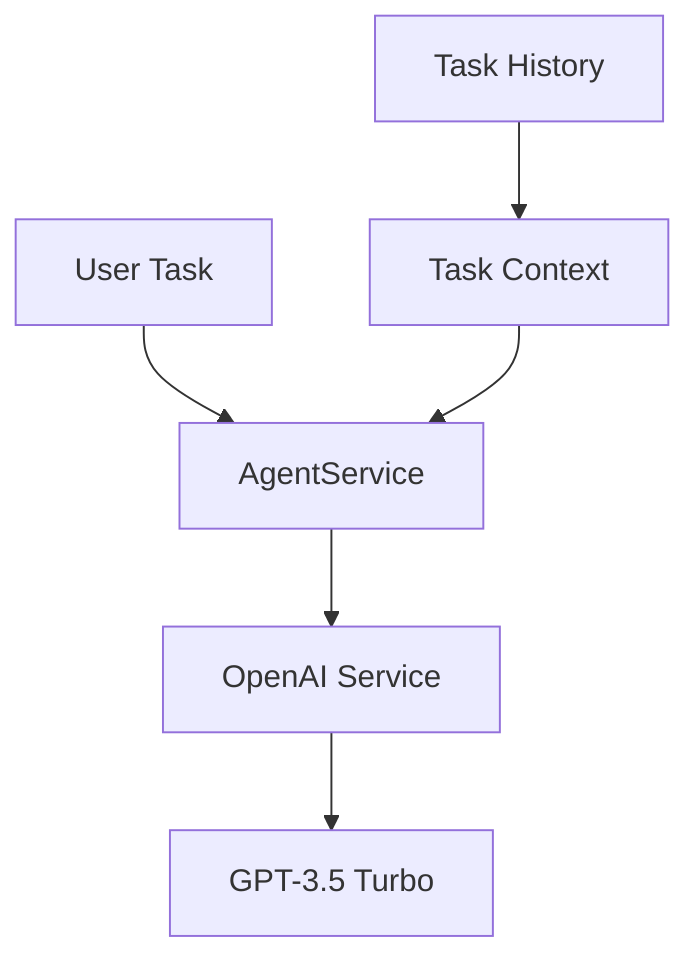

# IPE Agentic AI System Documentation

## 1. Core Integration Points

### 1.1 OpenAI Integration


**Key Integration Points:**
1. **API Connection**
   - OpenAI API Key from `.env`
   - Model: GPT-3.5 Turbo
   - Endpoint: chat.completions

2. **Data Flow**
   - User task → Context enrichment → OpenAI → Task planning
   - Step execution → OpenAI → Result analysis
   - Task completion → History storage

3. **Context Integration**
   - Task description
   - Task context (JSON)
   - Task history
   - Execution results

### 1.2 Task Management Integration

**Connection Points:**
1. **Data Storage**
   - Location: `./ipe_agent/`
   - Files:
     * `active_tasks.json`
     * `task_history.json`

2. **Data Flow:**
```plaintext
Task Creation → Task Planning → Step Execution → Task Completion → History Storage
```

3. **Integration Methods:**
   - Task creation and planning
   - Step execution tracking
   - Task status management
   - History archiving

### 1.3 Sample Data Integration

**Data Sources:**
1. **Task Data**
   - Format: JSON
   - Storage: Local JSON files
   - Fields:
     * Task ID
     * Description
     * Context
     * Status
     * Steps

2. **Execution Data**
   - Format: JSON
   - Storage: Local JSON files
   - Fields:
     * Step ID
     * Status
     * Result
     * Timestamps

3. **History Data**
   - Format: JSON
   - Storage: Local JSON files
   - Fields:
     * Task ID
     * Description
     * Status
     * Completion time
     * Results

## 2. Data Flow Paths

### 2.1 Task Creation Flow
```plaintext
1. User Input → AutomationPanel
2. AutomationPanel → AgentService
   - Create task
   - Plan steps
   - Save task
3. AgentService → OpenAI
   - Generate step plan
   - Validate steps
4. AutomationPanel → Update UI
```

### 2.2 Task Execution Flow
```plaintext
1. User Trigger → AutomationPanel
2. AutomationPanel → AgentService
   - Load task
   - Execute steps
   - Update status
3. AgentService → OpenAI
   - Execute step
   - Analyze results
4. AutomationPanel → Update UI
```

### 2.3 Task History Flow
```plaintext
1. Task Completion → AgentService
2. AgentService → History Storage
   - Archive task
   - Update history
3. History → UI Display
   - Show completed tasks
   - Filter and search
```

## 3. Integration Configuration

### 3.1 Environment Variables
```plaintext
OPENAI_API_KEY=your-api-key
OPENAI_MODEL=gpt-3.5-turbo
DEBUG=True
```

### 3.2 Task Configuration
```plaintext
Storage: Local JSON Files
Files: 
- active_tasks.json
- task_history.json
Status Tracking: Real-time
History: Persistent
```

### 3.3 Data Schemas

**Task Schema:**
```json
{
  "task_id": "string",
  "description": "string",
  "context": "object",
  "status": "string",
  "created_at": "datetime",
  "steps": [
    {
      "id": "string",
      "description": "string",
      "type": "string",
      "status": "string",
      "result": "string",
      "started_at": "datetime",
      "completed_at": "datetime"
    }
  ]
}
```

**History Schema:**
```json
{
  "task_id": "string",
  "description": "string",
  "status": "string",
  "created_at": "datetime",
  "completed_at": "datetime",
  "steps": [
    {
      "id": "string",
      "status": "string",
      "result": "string"
    }
  ]
}
```

## 4. Integration Points with External Systems

### 4.1 OpenAI Integration Details
- **Endpoint**: api.openai.com
- **Authentication**: API Key
- **Models Used**:
  * Task Planning: gpt-3.5-turbo
  * Step Execution: gpt-3.5-turbo
- **Rate Limits**: Managed through service layer

### 4.2 Task Management Details
- **Storage**: Local JSON files
- **Data Persistence**: File-based
- **Status Updates**: Real-time
- **Operations**:
  * Task creation
  * Step execution
  * Status tracking
  * History management

### 4.3 UI Integration Details
- **Framework**: Streamlit
- **Update Mechanism**: Real-time
- **Display Components**:
  * Task creation form
  * Active tasks list
  * Task execution view
  * History view

## 5. Error Handling and Retry Logic

### 5.1 OpenAI Service
```plaintext
1. Rate Limit Exceeded → Exponential backoff
2. API Error → Retry 3 times
3. Timeout → 30-second default
```

### 5.2 Task Management
```plaintext
1. File Error → Create new file
2. JSON Error → Backup and reset
3. Task Error → Mark as failed
```

### 5.3 UI Handling
```plaintext
1. Connection Error → Show retry option
2. Display Error → Clear and refresh
3. Input Error → Show validation message
```

## 6. Performance Considerations

### 6.1 Caching Strategy
- Task data: In-memory during session
- History data: File-based
- OpenAI responses: No caching

### 6.2 Batch Processing
- Task creation: Single task
- Step execution: Sequential
- History updates: Single task

### 6.3 UI Optimization
- Lazy loading of history
- Real-time status updates
- Efficient task filtering
