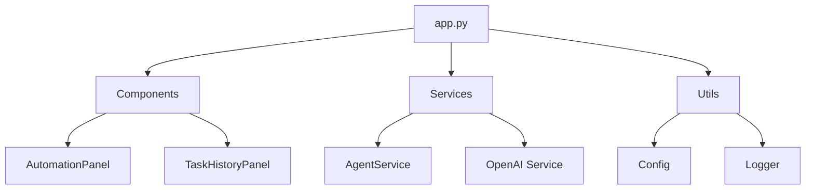

# Integrated Platform Environment (IPE) - Agentic AI System Architecture
________________________________________

## Table of Contents
1. System Overview
2. Core Components
3. Data Flow Architecture
4. Services Layer
5. Utilities
6. Configuration Management
7. Task Management
8. OpenAI Integration
9. Data Persistence
10. UI Components
11. Deployment Architecture

## 1. System Overview

### 1.1 Application Entry Point (app.py)
```python
# Main application flow in app.py
def main():
    # 1. Configuration Validation
    Config.validate()
    
    # 2. Session State Initialization
    initialize_session_state()
    
    # 3. Main UI Components
    current_page = render_sidebar()
    
    # 4. Page Routing
    if current_page == "Agent Tasks":
        AutomationPanel().render()
    elif current_page == "Task History":
        TaskHistoryPanel().render()
```

The application follows a modular architecture with these key components:
- UI Components (Streamlit-based)
- Services Layer (Business Logic)
- Data Layer (Task Management)
- Integration Layer (OpenAI)

### 1.2 Component Dependencies


## 2. Core Components

### 2.1 AutomationPanel Component
```python:src/components/automation_panel.py
class AutomationPanel:
    def __init__(self):
        self.agent_service = AgentService()
        self.logger = logging.getLogger(__name__)
        self.active_tasks = []

    def render(self):
        # 1. Display task creation form
        # 2. Show active tasks
        # 3. Handle task execution
        # 4. Manage task archiving
```

Key Features:
- Task creation interface
- Active task management
- Task execution control
- Real-time status updates

### 2.2 TaskHistoryPanel Component
```python:src/components/task_history_panel.py
class TaskHistoryPanel:
    def __init__(self):
        self.agent_service = AgentService()
        self.logger = logging.getLogger(__name__)

    def render(self):
        # 1. Load task history
        # 2. Display completed tasks
        # 3. Show execution details
        # 4. Enable history filtering
```

Features:
- Task history display
- Execution details view
- History filtering
- Result analysis

## 3. Data Flow Architecture

### 3.1 Task Management Integration
```python:src/services/agent_service.py
class AgentService:
    def __init__(self):
        self.openai_service = OpenAIService()
        self.logger = logging.getLogger(__name__)
        self.active_tasks = []
        self.task_history = []
        self._load_task_history()
        self._load_active_tasks()

    def _load_task_history(self):
        try:
            with open("task_history.json", "r") as f:
                self.task_history = json.load(f)
        except FileNotFoundError:
            self.task_history = []
```

Task Management Flow:
1. Task Creation:
   ```python
   def create_task(self, description: str, context: dict) -> dict:
       task_id = f"task_{len(self.active_tasks) + len(self.task_history) + 1}"
       task = {
           "task_id": task_id,
           "description": description,
           "context": context,
           "status": "pending",
           "created_at": datetime.now().isoformat(),
           "steps": self._plan_task_steps(description, context)
       }
       self.active_tasks.append(task)
       self._save_active_tasks()
       return task
   ```

2. Task Execution:
   ```python
   def execute_task(self, task_id: str) -> dict:
       task = self._get_task(task_id)
       if not task:
           raise ValueError(f"Task {task_id} not found")
           
       task["status"] = "running"
       for step in task["steps"]:
           step["status"] = "running"
           step["started_at"] = datetime.now().isoformat()
           
           # Execute step using OpenAI
           result = self._execute_step(step, task["context"])
           
           step["status"] = "completed"
           step["result"] = result
           step["completed_at"] = datetime.now().isoformat()
           
       task["status"] = "completed"
       self._save_active_tasks()
       return task
   ```

### 3.2 Data Persistence
```python:src/services/agent_service.py
class AgentService:
    def _save_active_tasks(self):
        try:
            with open("active_tasks.json", "w") as f:
                json.dump(self.active_tasks, f, indent=2)
        except Exception as e:
            self.logger.error(f"Error saving active tasks: {str(e)}")
            raise

    def _save_task_history(self):
        try:
            with open("task_history.json", "w") as f:
                json.dump(self.task_history, f, indent=2)
        except Exception as e:
            self.logger.error(f"Error saving task history: {str(e)}")
            raise
```

Data Flow:
1. Task Creation
2. Step Planning
3. Task Execution
4. History Storage
5. Status Updates

## 4. Services Layer

### 4.1 AgentService
```python:src/services/agent_service.py
class AgentService:
    def _plan_task_steps(self, description: str, context: dict) -> list:
        prompt = f"""Plan the steps for the following task:
        Description: {description}
        Context: {json.dumps(context)}
        
        Return a JSON array of steps, where each step has:
        - id: unique identifier
        - description: what needs to be done
        - type: action or analysis
        - parameters: any required parameters
        """
        
        response = self.openai_service.get_completion(prompt)
        return json.loads(response)
```

### 4.2 OpenAIService
```python:src/services/openai_service.py
class OpenAIService:
    def __init__(self):
        self.api_key = os.getenv("OPENAI_API_KEY")
        self.model = os.getenv("OPENAI_MODEL", "gpt-3.5-turbo")
        self.client = OpenAI(api_key=self.api_key)

    def get_completion(self, prompt: str) -> str:
        try:
            response = self.client.chat.completions.create(
                model=self.model,
                messages=[{"role": "user", "content": prompt}]
            )
            return response.choices[0].message.content
        except Exception as e:
            self.logger.error(f"Error getting OpenAI completion: {str(e)}")
            raise
```

## 5. Utilities

### 5.1 Configuration Management
```python:src/utils/config.py
class Config:
    @staticmethod
    def validate():
        required_vars = ["OPENAI_API_KEY"]
        for var in required_vars:
            if not os.getenv(var):
                raise ValueError(f"Missing required environment variable: {var}")
```

### 5.2 Logging Setup
```python:src/utils/logger.py
def setup_logger():
    logger = logging.getLogger(__name__)
    logger.setLevel(logging.INFO)
    
    handler = logging.StreamHandler()
    formatter = logging.Formatter(
        '%(asctime)s - %(name)s - %(levelname)s - %(message)s'
    )
    handler.setFormatter(formatter)
    logger.addHandler(handler)
    
    return logger
```

## 6. UI Components

### 6.1 Task Creation Form
```python:src/components/automation_panel.py
def render_task_creation_form(self):
    with st.form("task_creation_form"):
        description = st.text_area("Task Description")
        context = st.text_area("Task Context (JSON)")
        
        if st.form_submit_button("Create Task"):
            try:
                context_dict = json.loads(context) if context else {}
                task = self.agent_service.create_task(description, context_dict)
                st.success("Task created successfully!")
                st.rerun()
            except Exception as e:
                st.error(f"Error creating task: {str(e)}")
```

### 6.2 Active Tasks Display
```python:src/components/automation_panel.py
def render_active_tasks(self):
    st.subheader("Active Tasks")
    for task in self.agent_service.active_tasks:
        with st.expander(f"Task {task['task_id']} - {task['status']}"):
            st.write(f"Description: {task['description']}")
            st.write(f"Context: {json.dumps(task['context'], indent=2)}")
            
            # Show steps
            st.write("Steps:")
            for step in task["steps"]:
                st.write(f"- {step['description']} ({step['status']})")
                if step["status"] == "completed":
                    st.write(f"  Result: {step['result']}")
            
            # Show action buttons
            col1, col2 = st.columns(2)
            with col1:
                if st.button("Execute", key=f"exec_{task['task_id']}"):
                    self.agent_service.execute_task(task["task_id"])
                    st.rerun()
            with col2:
                if st.button("Archive", key=f"arch_{task['task_id']}"):
                    self.agent_service.archive_task(task["task_id"])
                    st.success("Task archived successfully!")
                    st.rerun()
```

## 7. Deployment Architecture

### 7.1 Local Development
```plaintext
1. Clone repository
2. Install dependencies:
   pip install -r requirements.txt
3. Set up environment variables:
   cp .env.example .env
4. Run application:
   streamlit run app.py
```

### 7.2 Production Deployment
```plaintext
1. Set up Python environment
2. Install dependencies
3. Configure environment variables
4. Run with process manager (e.g., PM2)
5. Set up monitoring
```

## 8. Error Handling

### 8.1 Service Layer
```python
try:
    # Operation
except Exception as e:
    self.logger.error(f"Error in operation: {str(e)}")
    raise
```

### 8.2 UI Layer
```python
try:
    # UI operation
except Exception as e:
    st.error(f"Error: {str(e)}")
```

## 9. Performance Optimization

### 9.1 Data Loading
- Lazy loading of task history
- In-memory caching of active tasks
- Efficient JSON file handling

### 9.2 UI Updates
- Real-time status updates
- Efficient task filtering
- Optimized rendering of task details 